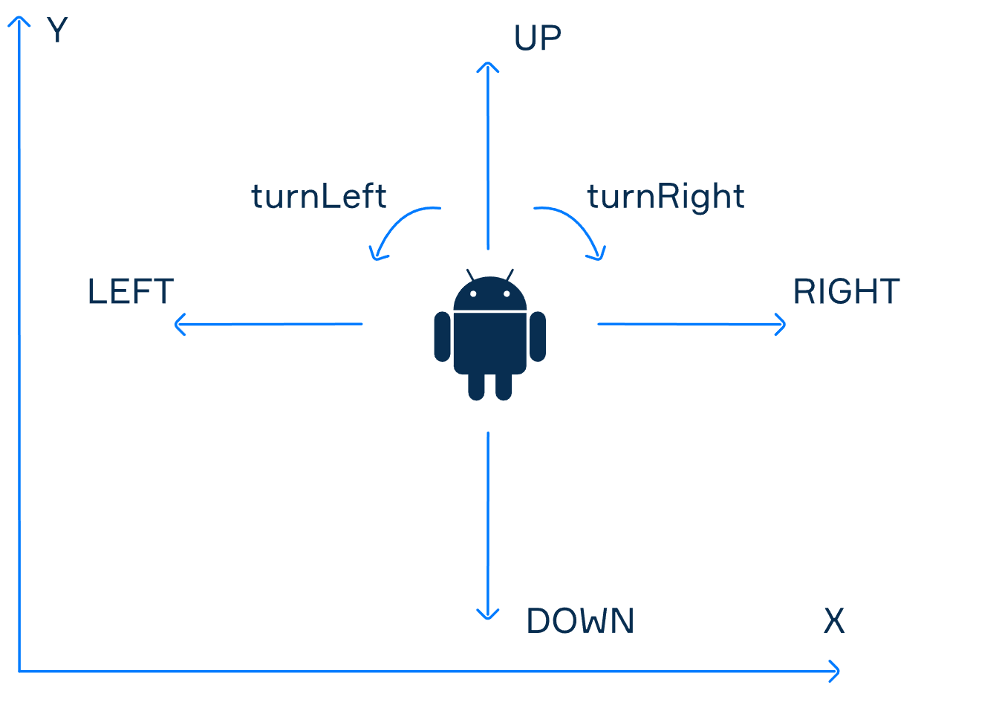

# Java Algorithm: Robot Control Simulation

## Problem Overview
This problem models a 2D coordinate system grid navigation algorithm. A robot starts at an unknown initial coordinate `(X, Y)` facing an initial direction (`UP`, `DOWN`, `LEFT`, `RIGHT`).

The objective is to implement the algorithm `moveRobot(Robot robot, int toX, int toY)` to safely navigate the robot to the requested destination `(toX, toY)` using only basic controls:
- `turnLeft()` — Rotate 90° counterclockwise
- `turnRight()` — Rotate 90° clockwise
- `stepForward()` — Move 1 step in the current direction



---

## Solution Logic

The navigation strategy breaks down the 2D movement into two separate axial phases:

1. **X-Axis Alignment:**
   - If current X < `toX`: Rotate until facing `RIGHT` and advance step-by-step.
   - If current X > `toX`: Rotate until facing `LEFT` and advance step-by-step.
2. **Y-Axis Alignment:**
   - If current Y < `toY`: Rotate until facing `UP` and advance step-by-step.
   - If current Y > `toY`: Rotate until facing `DOWN` and advance step-by-step.

---

## Code Implementation

```java
public class Move {
    public static void moveRobot(Robot robot, int toX, int toY) {
        // Move along X-axis
        if (robot.getX() < toX) {
            while (robot.getDirection() != Direction.RIGHT) {
                robot.turnRight();
            }
            while (robot.getX() != toX) {
                robot.stepForward();
            }
        } else if (robot.getX() > toX) {
            while (robot.getDirection() != Direction.LEFT) {
                robot.turnRight();
            }
            while (robot.getX() != toX) {
                robot.stepForward();
            }
        }

        // Move along Y-axis
        if (robot.getY() < toY) {
            while (robot.getDirection() != Direction.UP) {
                robot.turnRight();
            }
            while (robot.getY() != toY) {
                robot.stepForward();
            }
        } else if (robot.getY() > toY) {
            while (robot.getDirection() != Direction.DOWN) {
                robot.turnRight();
            }
            while (robot.getY() != toY) {
                robot.stepForward();
            }
        }
    }
}
```

---

## How to Compile & Run

1. Open your terminal in the directory.
2. Compile all Java source files:
   ```bash
   javac Direction.java Robot.java Move.java Main.java
   ```
3. Run the application:
   ```bash
   java Main
   ```

### Console Output
```text
Initial State 1: X=0, Y=0, Dir=UP
Final State 1:   X=3, Y=0, Dir=RIGHT
------------------------------------
Initial State 2: X=1, Y=1, Dir=RIGHT
Final State 2:   X=0, Y=-1, Dir=DOWN
```
